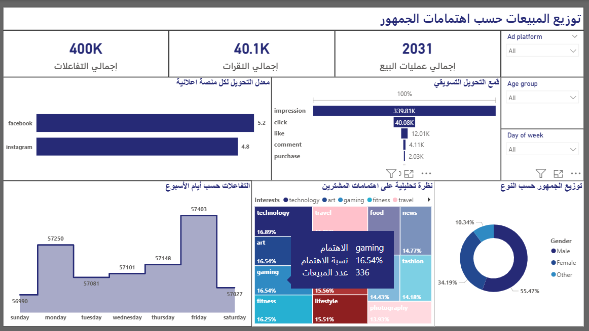

 
📊 Marketing Analytics Dashboard (SQL & Power BI)
🔍 Project Overview

This project focuses on analyzing marketing performance data to understand user behavior, campaign effectiveness, and sales conversion across different advertising platforms.

The goal is to transform raw marketing data into actionable insights using SQL for data preparation and Power BI for visualization and storytelling.

🛠 Tools & Technologies

SQL – Data extraction, transformation, and aggregation

Power BI – Interactive dashboards and visual analytics

DAX – KPI calculations and measures

Data Visualization Best Practices

📈 Key Features

Marketing Funnel Analysis
(Impressions → Clicks → Likes → Comments → Purchases)

Platform Conversion Comparison
Facebook vs Instagram conversion rates

Interest-Based Sales Analysis
Identifying which user interests generate the highest sales

Engagement by Day of Week
Discovering peak interaction days

Audience Demographics Breakdown
Gender-based distribution analysis

📊 Key KPIs

Total Impressions

Total Clicks

Total Interactions

Total Purchases

Conversion Rate by Platform

💡 Key Insights

Gaming and Technology interests generate the highest number of purchases

Friday shows the highest user engagement across campaigns

Facebook demonstrates a higher conversion rate compared to Instagram

📌 Business Recommendations

Increase ad spend on high-performing interests such as Gaming and Technology

Schedule major campaigns on Fridays to maximize engagement

Optimize Instagram campaigns to improve conversion efficiency

🗂 Project Structure
├── sql/
│   └── marketing_analysis.sql
├── powerbi/
│   └── Marketing_Performance_Dashboard.pbix
├── images/
│   └── dashboard_screenshots.png
└── README.md

▶ How to Run the Project

Run the SQL scripts to prepare the dataset

Open the .pbix file using Power BI Desktop

Refresh data if required

Explore dashboards using filters and slicers

👤 Author

Ahmed Elnagar
Data Analyst
🔗 GitHub: https://github.com/ahmedelnagar-dataanalyst
